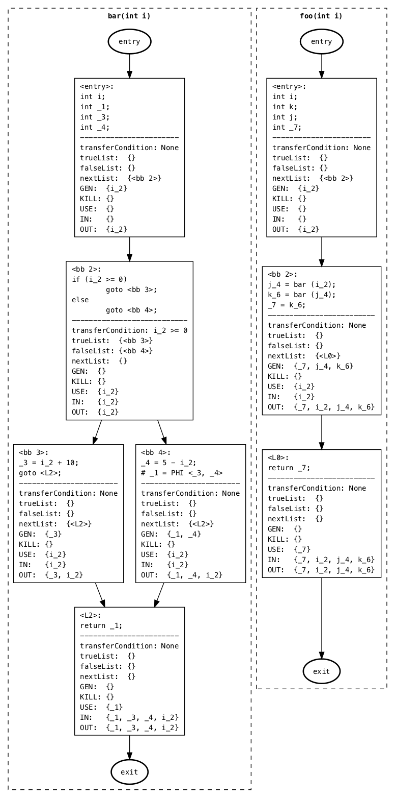
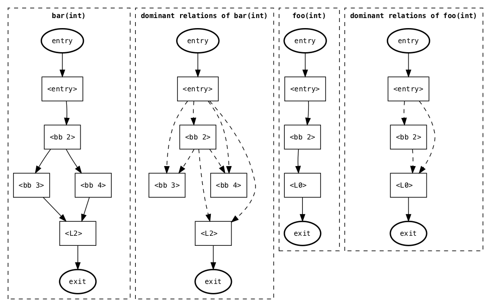
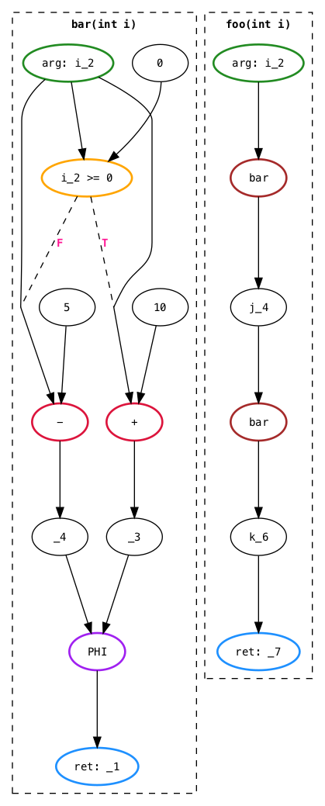

# ValueRangeAnalyser

潘学海 1500011317

## 运行环境

​	程序基于 Python ，且所有依赖包均为 Python 内建包。由于所有函数和变量均使用了 Type Hints ，故版本要求为 Python version >= 3.5。

​	同时为了更直观地显示各个函数及基本块之间的关系，我们使用了 `pygraphviz` 包进行对 Control Flow Graph (CFG) 和 Constraint Graph (CG) 进行可视化。但该包不是必须的，程序会自动尝试导入该包，若导入失败则在测试过程中不会绘制 CFG 和 CG。

```Python
# RangeAnalyser.py
# some code

class RangeAnalyser(object):
    # some code
    pass
    
    drawControlFlowGraph = None
    drawSimpleControlFlowGraph = None
    drawConstraintGraph = None

try:
    from pygraphviz import AGraph
    
    def drawControlFlowGraph(self: RangeAnalyser, file: str = None) -> AGraph:
        # some code
        pass
    
    def drawSimpleControlFlowGraph(self: RangeAnalyser, file: str = None) -> AGraph:
        # some code
        pass
    
    def drawConstraintGraph(self: RangeAnalyser, file: str = None) -> AGraph:
        # some code
        pass
    
    RangeAnalyser.drawControlFlowGraph: Callable[[RangeAnalyser, str], AGraph] = drawControlFlowGraph
    RangeAnalyser.drawSimpleControlFlowGraph: Callable[[RangeAnalyser, str], AGraph] = drawSimpleControlFlowGraph
    RangeAnalyser.drawConstraintGraph: Callable[[RangeAnalyser, str], AGraph] = drawConstraintGraph
except ImportError:
    RangeAnalyser.drawControlFlowGraph = None
    RangeAnalyser.drawSimpleControlFlowGraph = None
    RangeAnalyser.drawConstraintGraph = None
```

其中 CFG 的可视化结果中除了会显示各个数据块之间的控制关系外，还会包含数据流分析中得到的分析结果，如每个基本块的 `GEN`、`KILL`、`USE`、`IN`、`OUT` 等。

测试示例 `benchmark/t7.ssa` 得到的可视化结果如下：

Control Flow Graph of `t7.ssa`:



Simple Control Flow Graph of `t7.ssa`:



Constraint Graph of `t7.ssa`:



## 使用方法

### 常规测试

​	程序包含文件  `main.py`、`RangeAnalyser.py`、`Function.py`、`ValueRange.py` 四个源文件，使用前请将该四个文件置于同一目录下。

​	使用 Python 3.5 或以上版本执行 `main.py` 文件即可运行测试。

1. 输入 SSA 文件名，程序即会解析该文件并显示文件中的各个函数的信息。
2. 用户输入需要分析的函数名（若整个文件只有一个函数则自动选择）。
3. 用户依次输入函数各个参数的取值范围（若无参数则会自动跳过此步骤）。
4. 正确选择函数并确定参数范围后，程序会分析函数的可能输出范围并显示。
5. 输入下一个测试 SSA 文件名，或输入 `quit` 退出程序。

		变量范围的输入格式为 $[a,b]$，包含边界值。要求 $a \le b$，否则将视为空集。若遇到边界值为无穷时使用 `inf` 表示无穷，正无穷用 `+inf` 表示，负无穷用 `-inf` 表示，边界值为无穷时，括号仍需使用两个方括号 `[]` 表示。输入示例：`[0, 100]`、`[100, +inf]`、`[-inf, 0]`、`[-inf, +inf]`。

测试示例截图如下图所示：


### 快速测试

​	程序提供了快速测试 `benchmark` 文件夹下的 `t1.ssa` - `t10.ssa` 的函数 `benchmark()`，使用时请将变量 `useBenchmark` 设为 `True`（默认为 `False`）。使用快速测试模式时，请确保 `benchmark` 文件夹包含的 `t1.ssa` - `t10.ssa` 这 10 个 SSA 文件，且置于与源程序同一目录下。

```Python
# main.py
# imports

def printSsaInfo(ssaFile: str, analyser: RangeAnalyser) -> None:
    # some code
    pass

def main() -> None:
    # some code
    pass

def benchmark() -> None:
    testArgs: List[List[ValueRange]] = [
        [],
        [ValueRange(200, 300, int)],
        [ValueRange(0, 10, int), ValueRange(20, 50, int)],
        [ValueRange(-inf, +inf, int)],
        [],
        [ValueRange(-inf, +inf, int)],
        [ValueRange(-10, 10, int)],
        [ValueRange(1, 100, int), ValueRange(-2, 2, int)],
        [],
        [ValueRange(30, 50, int), ValueRange(90, 100, int)]
    ]
    refRanges: List[str] = ['[100, 100]',
                            '[200, 300]',
                            '[20, 50]',
                            '[0, +inf)',
                            '[210, 210]',
                            '[-9, 10]',
                            '[16, 30]',
                            '[-3.2192308, 5.94230769]',
                            '[9791, 9791]',
                            '[-10, 40]']
    for i, (testArg, refRange) in enumerate(zip(testArgs, refRanges), start = 1):
        ssaFile = 'benchmark/t{}.ssa'.format(i)
        # some code
        pass

if __name__ == '__main__':
    useBenchmark: bool = False # 若使用快速测试请改为 True
    if useBenchmark:
        benchmark()
    else:
        main()
```

快速测试使用的变量范围为 C 源程序的注释中的推荐范围。分析结束后，程序会显示输出范围及函数的实际输出范围。

使用快速测试模式测试截图如下图所示：


